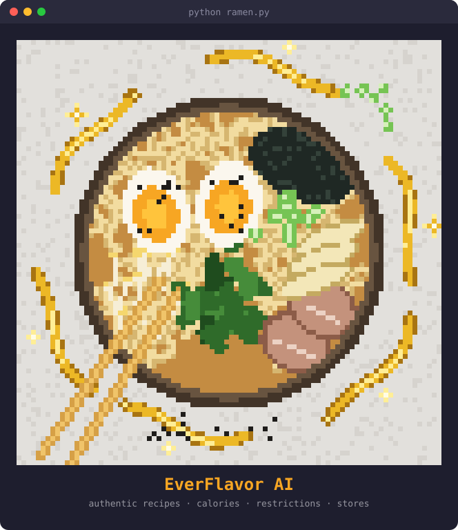
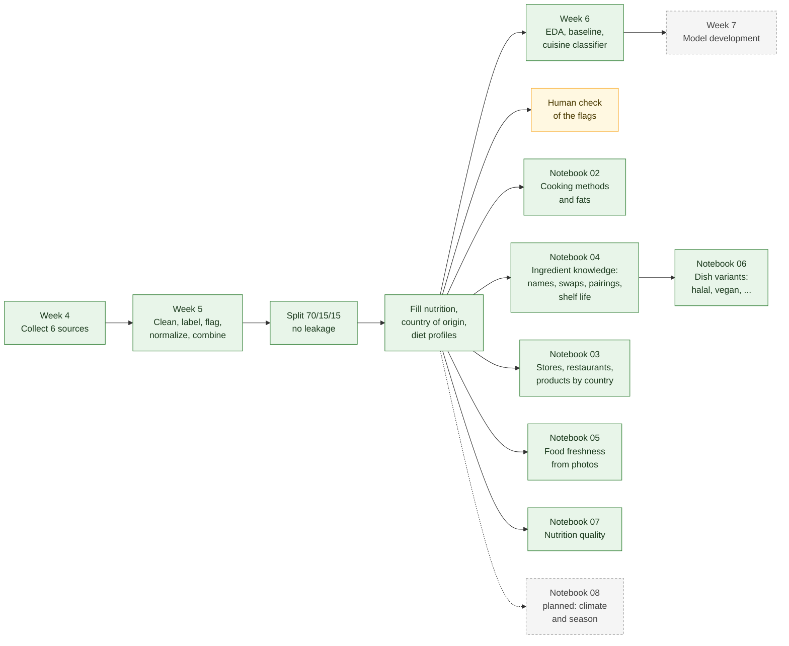
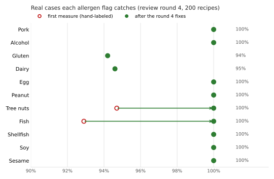
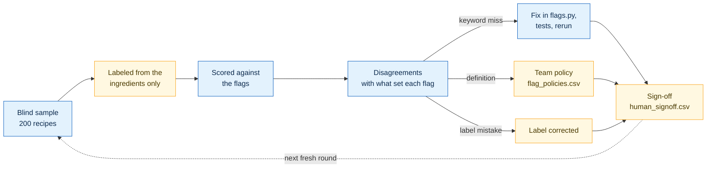

# EverFlavor AI

### Multi-Agent Diet & Discovery System

*A conversational multi-agent AI that helps users cook authentic global recipes within their calorie limits, dietary restrictions and ingredient availability, and then finds the nearest specialty supermarket.*


<div align="center">



<sub>Drawn with code: <a href="docs/art/ramen.py">docs/art/ramen.py</a> (run it to see it in color in your terminal)</sub>

**Team EverGlow** · ITAI 2277 Capstone

[Overview](#overview) · [Architecture](#architecture) · [Data Sources](#data-sources) · [Current Status](#current-status) · [Running the Notebook](#running-the-notebook) · [Using the Shared Code](#using-the-shared-code) · [Project Structure](#project-structure)

</div>

---

## Overview

**EverFlavor AI** removes the everyday decision fatigue around food. Users talk to the system in plain language:

> *"I have 550 calories left, no pork, I'm tired after work, and I want something bold from Middle Eastern or Latin American cuisine. I can drive 15 minutes."*

The system returns:

| | |
|---|---|
| **Recipe** | A complete step-by-step recipe from one of five major cuisine families |
| **Substitutions** | Smart ingredient swaps when something is unavailable or restricted |
| **Nutrition** | Accurate calories and macronutrients per serving |
| **Store** | The nearest specialty supermarket for that cuisine |
| **Safety** | Full respect for religious, medical and ethical restrictions |

**Cuisine families:** Asian · European · Latin American · African · Middle Eastern

---

## Architecture


| Agent | Responsibility |
|---|---|
| **Nutritionist & Preference Agent** | Extracts calories, restrictions, cuisine preference and driving radius |
| **Chef Agent** | Generates authentic recipes and practical substitutions |
| **Sourcing Agent** | Finds the nearest specialty supermarket |

**Orchestration:** a sequential CrewAI workflow with shared context. An independent safety filter runs after recipe generation and cannot be overridden by the LLM.

**Key features:**

- Human-in-the-loop safety gates
- Nutrition grounded in Open Food Facts and USDA FoodData Central
- Real specialty-store search through the Google Places API
- Gradio chat interface for demos

<details>
<summary><b>Tech stack and prototype scope</b></summary>

**Tech stack**

- **Language:** Python 3.10+
- **Multi-agent framework:** CrewAI
- **Interface:** Gradio
- **LLM:** Groq (LLaMA 3.1) or another tool-calling model
- **APIs:** Open Food Facts, USDA FoodData Central, Google Places
- **Safety:** hard-coded post-generation restriction filter

**Prototype scope**

- Five major cuisine families only
- One metro area for store search (e.g., Houston)
- Session-based user profiles
- Clear substitution logic
- Full restriction handling (religious, medical, ethical)

</details>

---

## Data Sources

### Recipe datasets

All four are collected in Week 4 of the notebook and combined into one recipe table in Week 5.

| Dataset | Size | What we use it for | How it is collected |
|---|---|---|---|
| [Food.com Recipes (Kaggle)](https://www.kaggle.com/datasets/shuyangli94/food-com-recipes-and-user-interactions) | ~231,000 recipes | Main recipe source: ingredients, steps, calories, cook time and cuisine tags (including ~2,800 African and ~2,000 Middle Eastern recipes) | `kagglehub` download |
| [Hugging Face: recipes-with-nutrition](https://huggingface.co/datasets/datahiveai/recipes-with-nutrition) | ~39,000 recipes | Exact nutrition (calories, protein, fat, carbs, sodium), health labels (vegetarian, gluten-free, allergens) and cuisine labels | `datasets` library |
| [CulinaryDB](https://cosylab.iiitd.edu.in/culinarydb/) | ~45,700 recipes, 22 regions | Extra African (~650) and Middle Eastern (~990) recipes; titles and ingredients only | Free zip download |
| [TheMealDB](https://www.themealdb.com) | ~790 recipes | Recipes with full instructions from many countries | Free public API (no key needed) |

### Nutrition and product lookups

Small samples are collected in Week 4. In Week 5, two free USDA bulk downloads (no key needed) fill in missing nutrition: FNDDS, about 5,400 prepared dishes with typical portion sizes, and SR Legacy, about 7,800 single ingredients. Later, the agents will look up ingredients through these APIs.

| Source | What we use it for | Key needed |
|---|---|---|
| [USDA FoodData Central](https://fdc.nal.usda.gov/) | Official calorie and nutrient values for single ingredients and prepared dishes | API: `USDA_API_KEY` (free); bulk downloads: no |
| [Open Food Facts](https://world.openfoodfacts.org) | Packaged and specialty products (miso, tahini, ghee): nutrition, allergens, Nutri-Score | No |

### Planned or optional

- **[RecipeDB](https://cosylab.iiitd.edu.in/recipedb/):** ~118,000 recipes with nutrition. Needs an API key from the CoSyLab team (see section 2.4.7 in the notebook).

### More pipelines (notebooks 03-08)

Notebooks 03, 04 and 05 are built and run without any API key (licenses read on 2026-10-04). Google Places (notebook 03) switches on once `GOOGLE_PLACES_API_KEY` is set; the freshness models (notebook 05) train once more image sources are downloaded and a GPU is available.

| Notebook | Sources | License |
|---|---|---|
| 03 Stores, restaurants and products (**built**) | Google Places API (store search for the Sourcing Agent); OpenStreetMap through the Overpass API; the [Open Food Facts product export](https://huggingface.co/datasets/openfoodfacts/product-database) (~4.8 million products) | Google terms (only place IDs are stored); ODbL; ODbL |
| 04 Ingredient knowledge (**built**) | Wikidata (ingredient names in other languages); Food.com reviews (substitutions, already downloaded); our own recipes (ingredient pairings); [USDA FoodKeeper](https://catalog.data.gov/dataset/fsis-foodkeeper-data) (shelf life) | CC0; as above; -; CC0 |
| 05 Computer vision: food freshness (**pipeline built**) | 11 image sources across fruits and vegetables, red meat, fish and bread (for example AgriFreshNET, TriModal Ripeness 6, MeatScan, DaFiF, two fish-eye sets), plus the team's own photos | Mostly CC BY 4.0; the Mendeley sets confirmed on their data records, three (MeatScan, two Roboflow sets) still to confirm |
| 06 Dish variants (**built**) | Notebook 04's substitutions and cooking guidance, checked with the flag rules | (no new source) |
| 07 Nutrition quality (**built**) | USDA SR Legacy (already downloaded): fiber, minerals and vitamins per ingredient | Public domain |
| 08 Climate and season (**planning sketch**) | [Our World in Data](https://ourworldindata.org/grapher/ghg-per-kg-poore) (Poore & Nemecek 2018); [AGRIBALYSE 3.2](https://doc.agribalyse.fr/documentation-en/agribalyse-data/data-access); a seasonal produce calendar | CC BY; Etalab Open License; to confirm |

<details>
<summary><b>Licenses</b></summary>

| Source | Terms |
|---|---|
| CulinaryDB, RecipeDB | CC BY-NC-SA 3.0: non-commercial use, with credit |
| Open Food Facts | Open Database License (ODbL) |
| USDA data | Public domain |
| Food.com, Hugging Face, TheMealDB | See each source's page |

This is a non-commercial student project. Check the terms again before any commercial use.

</details>

---

## Current Status

### Pipeline at a glance



<sub>Green: built and run · Yellow: decided by people · Gray: next</sub>

### Results so far

| | |
|---|---|
| **Recipes after cleaning** | **291,755** from 4 sources, duplicates removed |
| **By cuisine family** | European 48,151 · Asian 20,788 · Latin American 15,706 · Middle Eastern 3,406 · African 3,179 |
| **Restriction flags** | On the first hand-labeled check (round 4, 200 recipes) they catch 100% of real cases for 9 of the 11 main allergens; gluten 94%, dairy 95% (see the [chart](#restriction-flag-check)) |
| **Nutrition** | 245,463 recipes with listed nutrition; the other 46,308 estimated from similar recipes and USDA data (average error 186 kcal, with a likely range) |
| **Country of origin** | 121,450 labeled by their source (14,770 also with a region, e.g. Sichuan, Louisiana, Quebec); 109,259 predicted at 70%+ confidence (right about 90% of the time on validation); 61,046 `Unknown` |
| **Diet profiles** | Halal-friendly 76%, kosher-friendly 69%, pescatarian 63%, no beef 89%, Jain-friendly 15%, lower sodium 58%, low carb 28% of recipes |
| **Validation** | 26 automatic checks pass; no near-duplicate leakage between splits |
| **Baseline cuisine classifier** | Macro-F1 **0.62** on validation (see [model card](docs/model_card.md)) |
| **Cooking methods and fats** | Notebook 02: cooking methods for every recipe (rules agree with Food.com's own tags on 66–95% of tagged recipes per method), the cooking fats each recipe names, and a reference table of 31 fats; 49% of fried recipes do not say which frying fat they use |
| **Ingredient knowledge** | Notebook 04: names in 12 languages for 1,504 common ingredients (30,716 names, Wikidata), 2,161 substitutions mined from 1.1 million Food.com reviews with the flags each swap removes or adds, 105,730 ingredient pairings scored by PMI per cuisine and country, and USDA storage times for 1,512 ingredients |
| **Stores and products** | Notebook 03 (no key): 1,543 restaurants, groceries and butchers around the pilot area from OpenStreetMap; 1,020,381 Open Food Facts products (a spread sample of about a fifth of the 4.8 million) with brand, home country and whether they are sold in the US; 1,043 of 1,185 common ingredients linked to products (28,864 links); a coverage report for 91 origin countries. Every store suggestion is marked unverified |
| **Food freshness** | Notebook 05: one label scheme (fresh / aging / spoiled) for 11 image sources, license-checked downloads from Mendeley Data, near-duplicate groups and a split that keeps one item's photos together; 4 of 11 sources downloaded (AgriFreshNET, FruitNet, BananaImageBD, Multistage Fish Eyes): 30,363 original photos of 13 fruits and vegetables and of fish, 96% with a readable state, in 21,437 near-duplicate groups split 70/15/15. Training waits for a GPU |
| **Dish variants** | Notebook 06: 635,450 variants of dishes for 13 diets, each swap re-checked with the flag rules. Variants raise the dishes a vegan can eat from 17% to 44%, gluten-free from 48% to 67%, halal-friendly from 77% to 86%. Halal and kosher variants say that meat must come from a certified source |
| **Nutrition quality** | Notebook 07: share of calories from protein, fat and carbohydrate per serving (31% of recipes are high-protein), and "has an ingredient rich in" fiber, iron, calcium or vitamins (USDA, per 100 g; spices and oils left out). Recipes list no amounts, so no per-dish vitamin totals |
| **Code checks** | 133 automated checks pass (129 tests for the shared functions, 4 security checks) and cover 92% of `src/`; type hints in `src/` and `tests/` checked with mypy |

### Done (Weeks 4–6)

- Data collected from USDA FoodData Central, Open Food Facts, Food.com (Kaggle), Hugging Face, CulinaryDB and TheMealDB.
- Cleaning and feature engineering:
  - cuisine family for every source, using Food.com's cuisine tags
  - restriction flags for pork, alcohol, gluten, dairy, egg, peanut, tree nuts, fish, shellfish, soy and sesame, vegetarian and vegan, plus meat, beef, gelatin, honey, root vegetables, onion and garlic for the diet profiles
  - flags from a review of dietary restrictions worldwide: the allergens other countries label (shellfish split into crustaceans and molluscs, mustard, celery, lupin, buckwheat, sulfites), religious and cultural rules (fish without scales, other non-kosher meat, insect coloring, asafoetida, mushrooms, coffee and tea, added salt, alcohol-based flavor extracts) and medical screens (fava beans, nightshades, high-mercury fish, raw animal foods, soft cheese, high-purine and high-tyramine foods)
  - the kind of meat: red meat (meat from mammals, pork included), poultry (white meat) and processed meat, following USDA and WHO / IARC definitions (fish and shellfish are their own groups)
  - calories and macronutrients in grams per serving
  - normalized ingredient lists and a complexity score
- All sources combined into one recipe table and saved as Parquet.
- Missing nutrition filled in: every recipe without believable listed values gets an estimate, labeled `estimated`, with a likely calorie range and the closest official USDA dish as a reference. A USDA nutrition table for about 40,000 ingredient names is saved for the Nutritionist Agent.
- Country of origin for every recipe: from the source's own labels where they name one country (with a region only when the source names it), otherwise predicted by a model when it is at least 70% confident, otherwise `Unknown`. `origin_source` says which.
- Recipes the project never serves are removed (policies P24, P25): meat from household pets (dogs, cats, guinea pigs; none were found) and recipes made for animals (dog biscuits, food for dogs; 16 removed). The safety filter also rejects pet meat for every user.
- Diet profiles defined once as rules over the ingredient flags (halal-, kosher- and Jain-friendly, pescatarian, no beef, lower sodium, low carb; lacto-vegetarian, Vaishnava, Mahayana Buddhist, Orthodox fasting, Adventist, Latter-day Saint and Rastafari Ital; and medical screens for alpha-gal syndrome, pregnancy, G6PD deficiency, gout, MAOI medicines and nightshades), plus the allergen lists of the US, EU / UK, Canada, Australia / NZ, Japan and South Korea, used by the table, the validation checks and the safety filter alike. "-friendly" means no forbidden ingredients, never certified.
- Data quality:
  - quantities removed from ingredient names
  - nutrition plausibility checks
  - a train/validation/test split (70/15/15) that keeps near-duplicate recipes together, so there is no leakage
  - 26 automatic validation checks
  - a dataset record of versions and settings (`dataset_info.json`)
- Exploratory analysis with charts showing what each step changed (`data/processed/figures/`).
- A rule-based baseline recommender with a final safety filter, for restrictions such as "no pork, no alcohol".
- A leak-free feature pipeline and a baseline cuisine classifier.
- Reusable code moved into `src/everflavor/` (one copy for the notebook and, later, the agents), with type hints, documented functions, 129 automated tests and 4 security checks run before each push. Long steps (downloads, Open Food Facts searches, model training) show progress bars.
- Cooking methods and cooking fats (notebook 02): methods from the instructions, checked against Food.com's own method tags; the fats each recipe names; a cited reference table of 31 fats (smoke point ranges, USDA fat breakdown, allergens, flavor, where each is traditional); and a caution for fried recipes whose frying fat is not stated.
- Human verification of the flags (section 5.13): the evidence is gathered automatically, and people make and record the decisions (see below).
- Ingredient knowledge (notebook 04), for the Chef and Nutritionist agents: ingredient names across languages (Wikidata), substitutions reviewers made (each checked against the recipe's own ingredients, with the restriction flags it removes or adds, plus alcohol-free swaps), ingredient pairings per cuisine and country, and USDA FoodKeeper shelf life worded as guidance, never a guarantee. Ambiguous matches go to a hand check.
- Stores, restaurants and products (notebook 03), for the Sourcing Agent: OpenStreetMap places with cuisine and halal / kosher / vegan tags, Open Food Facts products by home country, ingredient -> product links, suggestions of where to buy that never claim a store has something, and a coverage report by country. Google Places is ready and keeps only place IDs, as Google's terms require.
- Food freshness from photos (notebook 05): one label scheme for every image source, license-checked downloads, near-duplicate grouping, a split without leakage, source-balanced weights, a safety-first model score (how often spoiled food is called fresh) and the training loop. Every answer says it only judges how food looks.

### Restriction flag check

<div align="center">



</div>

<sub>Drawn by <a href="docs/art/flag_recall.py">docs/art/flag_recall.py</a>. Gluten and dairy misses are mostly label questions the team is checking (for example coconut milk labeled as dairy).</sub>

Each review round follows the same loop, and people make every final decision:



<sub>Blue: done by the notebook · Yellow: done by people</sub>

Blind 200-recipe samples were labeled (by Claude, an AI assistant, from the ingredients and dish names) and scored in section 5.12. Round 1 showed that gluten was caught only 81% of the time, because wheat is often implied by a product name (crackers, pastry, spaghetti, croutons, burger buns). The keyword lists were extended twice and the flags now read recipe names too; the latest fresh sample (round 3, which also checks the diet flags) measures 100% recall for every flag except shellfish (92%). Details and labeling rules: [docs/flag_review/labeling_notes.md](docs/flag_review/labeling_notes.md).

All 30 round 3 disagreements were then traced to what set each flag: 17 were keyword bugs (now fixed), 2 were allergens hidden inside ready-made ingredients, 4 were wrong AI answers and 7 were matters of definition. Round 3 is therefore optimistic now, and round 4 is the fresh sample for the next measurement.

Round 4 was labeled by hand by a team member (Chloe-Tu2) and scored before any fix, so it is the first independent measure: gluten was caught 94% of the time, dairy 95%, fish 93%, tree nuts 95%. Of its 149 disagreements, most are matters of definition (the labels count fish as meat and cream cheese as soft cheese) or likely label mistakes (coconut milk as dairy, black pepper as a nightshade). The real misses are fixed: pilchard and other fish names, chestnut (but not water chestnut) and ground buffalo, now kept in named groups with their look-alikes (`FOOD_NAME_GROUPS`). Every keyword now also matches with or without accents and hyphens ("crème fraîche", "rib-eye"). The check also found that 383 recipes with goat cheese were wrongly counted as vegan, now fixed. Round 4 is therefore optimistic now as well; the team still checks its disagreements and signs it off.

**Human verification (section 5.13).** An AI checking an AI is not independent, so people make the final decisions, and the notebook records them in `docs/flag_review/`:

- **Policies** (`flag_policies.csv`): definitions such as "oats count as gluten" or "pork is red meat", each with its reason and source, approved by a named person. All 25 are approved, including P23 (wines named without the word "wine", and cider) and P18 (halal: alcohol-based flavor extracts, insect coloring and animal rennet without confirmed halal sourcing are not halal-friendly; shrimp and molluscs are). The halal rule in the code does not apply P18 yet.
- **Hidden allergens** (`compound_ingredients_review.csv`): for ready-made ingredients such as "ranch dressing", Open Food Facts products are checked for the allergens their labels declare. 291 ingredients used in at least 100 recipes were checked; 52 had allergens our rules missed. 50 were approved, for example asafoetida (hing) usually contains wheat flour, chocolate chips contain soy, Worcestershire sauce and pancake mix contain gluten, and ranch dressing contains dairy, egg and soy. 4 were rejected because the matched products were a different food (instant noodles for "noodle", canned spaghetti for "spaghetti sauce"). Claude prepared this review and a team member (Evaabou20) checked every entry on 2026-10-04, keeping pizza crust's gluten but not its dairy, which varies by product. These ingredients count only in the ingredient list, never in the dish name, so "Vegan Cookies" stays vegan.
- **Sign-off** (`human_signoff.csv`): a reviewer checks a round's disagreements and signs it off. The completion checklist ticks this only when a person has done it. Round 3 was signed off by Evaabou20 on 2026-10-04.

The steps take no coding: [docs/flag_review/HOW_TO_SPOT_CHECK.md](docs/flag_review/HOW_TO_SPOT_CHECK.md).

### Known data gaps

- Many recipes still have no cuisine label ("Other"), mostly American recipes and Food.com recipes without a cuisine tag.
- Predicted countries are a good guess, not a fact (about 90% right overall, 77-97% depending on the country), and 21% of recipes still have no country. Regions exist only where a source names them.
- The flag labels used to measure accuracy were made by an AI assistant; until a person signs off a round (section 5.13), treat the accuracy numbers as estimates.
- Recipes rarely name their frying fat, and no open data says which oil a restaurant uses, so fat information for fried dishes stays a caution, never a guarantee.
- Food.com macros are converted from percent of daily value, so they are approximate.
- CulinaryDB and TheMealDB publish no nutrition, and CulinaryDB lists no amounts or servings, so their calories are estimates (labeled as such). A typical estimate is off by about 100 kcal per serving.
- Restriction flags come from keywords in the ingredients and recipe names (plus Hugging Face health labels), so they are approximate; the rarer allergens (peanut, shellfish, soy, sesame) are the least reliable.
- The baseline classifier confuses African and Middle Eastern recipes (F1 about 0.35 each).

See the [datasheet](docs/datasheet.md) for the full description of the dataset.

### Next

Week 7 model development, then the CrewAI agents and the Gradio interface (they can use Groq or Claude once a key is added). More image sources and a GPU for the freshness models (notebook 05), and the Google Places key for live store details (notebook 03).

---

## Running the Notebook

Each data pipeline has its own notebook. They share the code in `src/everflavor/` and pass data to each other through saved files, so run them in this order:

| Order | Notebook | What it does | Needs |
|---|---|---|---|
| 1 | `notebooks/01_data_acquisition_EverFlavor_V3.ipynb` | Weeks 4-6: collects, cleans, flags and combines the recipes, fills nutrition and origin, verifies the flags, analyzes the data | `USDA_API_KEY` |
| 2 | `notebooks/02_cooking_methods_and_fats.ipynb` | Cooking methods and cooking fats for every recipe, and the cooking-fat reference table | Notebook 01's saved files (same Colab session or same computer) |
| 3 | `notebooks/03_stores_and_products.ipynb` | Stores, restaurants and products by country, and where to buy each ingredient | Notebook 01's saved files; optional `GOOGLE_PLACES_API_KEY` |
| 4 | `notebooks/04_ingredient_knowledge.ipynb` | Ingredient names in other languages, substitutions, pairings and shelf life | Notebook 01's saved files and the Food.com download (no key) |
| 5 | `notebooks/05_computer_vision_freshness.ipynb` | How fresh food looks in a photo: image index, labels, split and training | Image sources (one downloads by itself); a GPU for training |
| 6 | `notebooks/06_dish_variants.ipynb` | Halal, vegan, gluten-free ... versions of each dish | Notebook 01 and 04's saved files |
| 7 | `notebooks/07_nutrition_quality.ipynb` | Macros per serving and nutrient-rich ingredients | Notebook 01's saved files |
| 8 | `notebooks/08_climate_and_season.ipynb` | **Planning sketch:** carbon footprint and what is in season | Notebook 01's saved files |

All of them run unchanged in **Google Colab**, **VS Code** and **Antigravity** (notebook 05 trains only when `TRAIN = True`). The setup cell detects the environment, moves to the project folder and loads API keys from the right place.

Running all cells of notebook 01 in order does everything for it: Week 4 downloads all six sources, Week 5 cleans and combines them, and Week 6 analyzes them. The only key needed is `USDA_API_KEY`.

The notebook's reusable code (download helpers, cleaning, restriction flags, diet rules, USDA matching, the pipeline, validation and the safety filter) lives in **`src/everflavor/`**, and the notebook imports it. The setup cell adds `src/` to Python's path; if the notebook was opened on its own (for example in Colab straight from GitHub), it downloads that folder from the repository first.

<details>
<summary><b>Google Colab</b></summary>

1. Open the notebook in Colab.
2. Click the key icon in the left sidebar and add a secret named `USDA_API_KEY` ([get a free key](https://fdc.nal.usda.gov/api-guide.html)). Switch on **Notebook access**.
3. Run all cells. Colab clears `data/` when its session ends, so a new session downloads the data again.

</details>

<details>
<summary><b>VS Code or Antigravity</b></summary>

1. Install the **Python** and **Jupyter** extensions.
2. In a terminal in the project folder, run `pip install -r config/requirements.txt`.
3. Copy `config/.env.example` to `config/.env` and fill in `USDA_API_KEY`. Git ignores `.env`, so your keys are never pushed.
4. Open the notebook, pick the Python interpreter you installed into as the kernel, and run all cells.

</details>

> **Tips**
>
> - After a kernel restart, run sections 2.2 and 2.3 again before any later section.
> - Downloads already on disk are reused, so after an interruption just run all cells again; only what is missing is downloaded.
> - Section 2.3.2 lists what is already downloaded or built, without downloading anything.
> - After editing a file in `src/everflavor/`, restart the kernel (or run `importlib.reload(...)` on that module) so the notebook picks up the change.
> - To download everything again, set `REFRESH_DOWNLOADS = True` in the setup cell (2.3.1).

**Disk space.** The GitHub copy is small (about 6 MB: code, docs and notebooks). A full run of notebook 01 adds about 0.4 GB in `data/` (git-ignored, recreated by the notebook) and about 1.7 GB of download caches outside the project (Kaggle and Hugging Face, in your user folder's `.cache`), which later runs reuse. Deleting either one only means the next run downloads or rebuilds it.

### Output files

Generated files are not committed; the notebook recreates them.

| File | What it is |
|---|---|
| `data/interim/recipes_all.parquet` | The combined, cleaned recipe table |
| `data/processed/recipes_train.parquet`, `recipes_val.parquet`, `recipes_test.parquet` | The three splits |
| `data/processed/figures/` | Every chart, as a PNG image |
| `data/processed/dataset_info.json` | Source versions, settings and row counts for the run |
| `models/cuisine_baseline.joblib` | The fitted baseline pipeline |
| `data/interim/recipe_cooking_labels.parquet` | Notebook 02: cooking methods and fats per recipe (join on `recipe_id`) |
| `data/processed/cooking_fats_reference.csv` | Notebook 02: the cooking-fat reference table with its USDA fat breakdown |
| `data/processed/ingredient_names.parquet` | Notebook 04: each ingredient's names in the pilot languages, with its Wikidata item |
| `data/processed/ingredient_substitutions.parquet` | Notebook 04: swaps reviewers made, with the flags each removes or adds, and alcohol-free swaps |
| `data/processed/ingredient_pairings.parquet` | Notebook 04: ingredient pairs scored by PMI, overall, per cuisine family and per country |
| `data/processed/ingredient_shelf_life.parquet` | Notebook 04: USDA FoodKeeper storage times in days for each matched ingredient |
| `data/processed/places.parquet` | Notebook 03: restaurants, groceries and butchers (OpenStreetMap; Google place IDs when a key is set) |
| `data/processed/products_by_country.parquet` | Notebook 03: Open Food Facts products with brand, home country and whether they are sold in the US |
| `data/processed/ingredient_products.parquet` | Notebook 03: recipe ingredient -> products, with how they matched |
| `data/processed/region_coverage_stores.csv` | Notebook 03: how ready each origin country is for the Sourcing Agent |
| `data/processed/freshness_images.parquet` | Notebook 05: one row per image with its label, photo set, duplicate group, split and weight |
| `data/processed/freshness_coverage.csv` | Notebook 05: images per food group, item, state and source |
| `data/processed/recipe_variants.parquet` | Notebook 06: for each dish and diet it does not fit, the swaps and new ingredients (or what has no safe swap) |
| `data/processed/ingredient_micronutrients.csv` | Notebook 07: fiber, minerals and vitamins per 100 g, % Daily Value and "rich in" tags per ingredient |
| `data/processed/recipe_nutrition_quality.parquet` | Notebook 07: calorie shares, macro labels and nutrient-rich ingredients per recipe |

Parquet is a compressed format that a text editor cannot open. To look at a Parquet file, either:

- load it in a notebook with `pd.read_parquet("data/interim/recipes_all.parquet").head()`, or
- install the **Data Wrangler** extension in VS Code.

---

## Using the Shared Code

Anything outside the notebook (the agents, a script, another notebook) can use exactly the same rules the data was built with:

```python
import sys
sys.path.insert(0, "src")   # from the project folder

from everflavor.ingredients import normalize_ingredient_list
from everflavor.flags import keyword_flag
from everflavor.recommend import passes_safety_filter

normalize_ingredient_list(["2 cups basmati rice", "Chopped Onions"])   # ['basmati rice', 'onion']
keyword_flag("graham cracker | smoked ham", "contains_pork")          # True
```

**Conventions** (based on the [Google Python Style Guide](https://google.github.io/styleguide/pyguide.html) and [PEP 257](https://peps.python.org/pep-0257/)), so new code fits in:

- every public function has type hints and a docstring with `Args`, `Returns` and `Raises`;
- functions never change the dataframe they are given; they return a new one;
- settings such as API keys, folders and `REFRESH_DOWNLOADS` are passed in as arguments;
- wrong input fails early with a `ValueError` that names the missing column;
- rule tables (keywords, maps, limits) are UPPER_CASE constants in their module;
- each module lists its supported functions in `__all__`; names starting with `_` are internal helpers that may change, so call the public function instead (for example `run_pipeline`, not `_prepare_foodcom`).

**Tests:** `tests/test_everflavor.py` checks what each function promises (whole-word flag matching, diet rules, origin labels, cleaning, splitting, the safety filter, and that inputs are never changed). Run it from the project folder with `python tests/test_everflavor.py` (no install needed) or `python -m pytest tests`.

**Security checks** (`tests/test_security.py`): run them before every push. They confirm that `config/.env` is ignored by git, that no API key appears in any committed file (notebook outputs included), that saved outputs show no local paths with your username, and that user input cannot change an API request's URL. A failure names the file and the key's name, never the key. They need no extra install: `python tests/test_security.py`.

**All checks**, for editing the code locally in **VS Code or Antigravity** (optional; the notebook does not need these tools, and Colab can skip them). Install once in a terminal in the project folder with `pip install -r config/requirements-dev.txt`, then run:

```bash
# in the VS Code / Antigravity terminal, from the project folder
python -m pytest tests                                   # the tests, including the security checks
python -m mypy --config-file config/mypy.ini            # the type hints (src and tests)
python -m ruff check src tests notebooks                 # mistakes and style
python -m pymarkdown --config config/pymarkdown.json scan README.md docs   # Markdown formatting
```

GitHub runs the same checks automatically on every push and pull request (`.github/workflows/checks.yml`; results under the repository's **Actions** tab), so a broken change is caught even if someone forgets to run them.

**Working rules.** Every change follows [docs/CONTRIBUTING.md](docs/CONTRIBUTING.md): runs unchanged in Colab, VS Code and Antigravity; all checks pass before a push; keys never leave Colab Secrets or `config/.env`; flags only ever add cautions; every judgment call is a recorded policy with the name of who decided it; and README numbers come from the latest full run.

---

## Project Structure

```text
The-EverFlavor-AI/
├── notebooks/
│   ├── 01_data_acquisition_EverFlavor_V3.ipynb   # Weeks 4-6: data acquisition, preprocessing, EDA, baseline
│   ├── 02_cooking_methods_and_fats.ipynb          # Cooking methods and fats (run after notebook 01)
│   ├── 03_stores_and_products.ipynb               # Stores, restaurants, products by country, where to buy
│   ├── 04_ingredient_knowledge.ipynb              # Names across languages, substitutions, pairings, shelf life
│   ├── 05_computer_vision_freshness.ipynb         # Food freshness from photos: labels, split, training
│   ├── 06_dish_variants.ipynb                     # Halal, vegan, gluten-free ... versions of each dish
│   ├── 07_nutrition_quality.ipynb                 # Macros per serving, nutrient-rich ingredients
│   └── 08_climate_and_season.ipynb                # Planning sketch: carbon footprint, seasons
├── data/
│   ├── reference/    # Hand-made reference tables with sources (committed): cooking_fats.csv
│   ├── raw/          # Original downloads and samples (generated, not committed)
│   ├── interim/      # Combined, cleaned recipe table (generated, not committed)
│   └── processed/    # Train/val/test splits, charts (figures/), dataset_info.json (generated, not committed)
├── models/           # Fitted baseline pipeline (generated, not committed)
├── src/
│   └── everflavor/   # Shared code: imported by the notebook now and by the agents later
│       ├── sources.py, environment.py   # downloads, secrets, download checker
│       ├── ingredients.py, cuisine.py   # ingredient normalizing, cuisine and origin
│       ├── flags.py, diets.py           # restriction flags and diet profiles
│       ├── nutrition.py, features.py    # nutrition, USDA matching, text features
│       ├── pipeline.py                  # cleaning, run_pipeline, combining, splitting, validation
│       ├── review.py                    # flag review rounds and the human-verification evidence
│       ├── cooking.py                   # cooking methods, cooking fats, alcohol left after cooking (notebook 02)
│       ├── knowledge.py                 # names, substitutions, pairings, shelf life (notebook 04)
│       ├── stores.py                    # OpenStreetMap, Google Places, Open Food Facts products (notebook 03)
│       ├── freshness.py                 # image labels, duplicates, split, training (notebook 05)
│       ├── variants.py                  # dish variants for a target diet (notebook 06)
│       ├── nutrition_quality.py         # macro labels and nutrient-rich ingredients (notebook 07)
│       └── recommend.py, charts.py, reporting.py, parsing.py, checks.py, progress.py
├── tests/
│   ├── test_everflavor.py   # What each shared function promises
│   ├── test_helpers.py      # Helper modules: environment, reporting, charts, features, recommender
│   ├── test_matching_and_review.py  # USDA matching and the flag review tools
│   ├── test_knowledge.py    # Notebook 04's knowledge tables, with fake Wikidata and FoodKeeper answers
│   ├── test_stores.py       # Notebook 03: places, products and the Google key never shown
│   ├── test_freshness.py    # Notebook 05: labels, duplicates, split, weights, license check
│   ├── test_variants.py     # Notebook 06: a variant never keeps or adds a forbidden ingredient
│   ├── test_nutrition_quality.py  # Notebook 07: Daily Value shares and macro labels
│   ├── test_pipeline.py     # run_pipeline end to end on tiny tables shaped like each source
│   ├── test_sources.py      # Download helpers with fake network answers (no real requests)
│   └── test_security.py     # Pre-push checks: no keys or local paths in committed files
├── docs/
│   ├── art/          # ramen.py (the ramen bowl) and flag_recall.py (the flag chart) draw the README art
│   ├── proposal/     # Capstone proposal slides and Phase 1-2 documents (PDF)
│   ├── flag_review/  # Blind 200-recipe samples per round, their labels, and the human decisions
│   │                 # (flag_policies.csv, compound_ingredients_review.csv, human_signoff.csv)
│   ├── CONTRIBUTING.md     # Working rules for every change (team and AI assistants)
│   ├── datasheet.md        # What is in the dataset, how it was built, known limits
│   ├── data_dictionary.md  # Every column of the recipe table
│   ├── sources.md          # Every data source: URL, license, access method, version
│   ├── ethics_privacy.md   # Privacy, licenses and responsible use
│   ├── model_card.md            # Baseline cuisine classifier: results and limits
│   ├── model_card_nutrition.md  # Missing-nutrition estimator (USDA + similar recipes)
│   └── model_card_origin.md     # Country-of-origin model
├── config/
│   ├── requirements.txt      # Python libraries for the notebook
│   ├── requirements-dev.txt  # Optional checking tools (VS Code / Antigravity)
│   ├── mypy.ini              # Settings for the type checker
│   ├── pymarkdown.json       # Settings for the Markdown checker
│   └── .env.example          # Template for API keys (copy to config/.env, which git ignores)
├── .github/workflows/checks.yml  # The checks GitHub runs on every push
├── .gitignore
├── LICENSE
└── README.md
```

---

<div align="center">

**EverFlavor AI** · Team EverGlow · ITAI 2277 Capstone · [MIT License](LICENSE)

</div>
