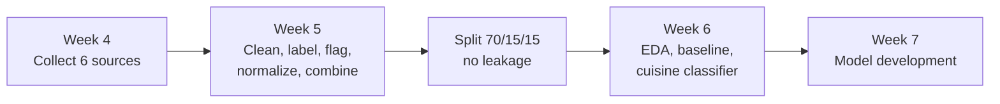

# EverFlavor AI

### Multi-Agent Diet & Discovery System

*A conversational multi-agent AI that helps users cook authentic global recipes within their calorie limits, dietary restrictions and ingredient availability, and then finds the nearest specialty supermarket.*


<div align="center">


<sub>Drawn with code: <a href="docs/art/ramen.py">docs/art/ramen.py</a> (run it to see it in color in your terminal)</sub>

**Team EverGlow** · ITAI 2277 Capstone

[Overview](#overview) · [Architecture](#architecture) · [Data Sources](#data-sources) · [Current Status](#current-status) · [Running the Notebook](#running-the-notebook) · [Project Structure](#project-structure)

</div>

---

## Overview

**EverFlavor AI** removes the everyday decision fatigue around food. Users talk to the system in plain language:

> *"I have 550 calories left, no pork, I'm tired after work, and I want something bold from Middle Eastern or Latin American cuisine. I can drive 15 minutes."*

The system returns:

| | |
|---|---|
| **Recipe** | A complete step-by-step recipe from one of five major cuisine families |
| **Substitutions** | Smart ingredient swaps when something is unavailable or restricted |
| **Nutrition** | Accurate calories and macronutrients per serving |
| **Store** | The nearest specialty supermarket for that cuisine |
| **Safety** | Full respect for religious, medical and ethical restrictions |

**Cuisine families:** Asian · European · Latin American · African · Middle Eastern

---

## Architecture


| Agent | Responsibility |
|---|---|
| **Nutritionist & Preference Agent** | Extracts calories, restrictions, cuisine preference and driving radius |
| **Chef Agent** | Generates authentic recipes and practical substitutions |
| **Sourcing Agent** | Finds the nearest specialty supermarket |

**Orchestration:** a sequential CrewAI workflow with shared context. An independent safety filter runs after recipe generation and cannot be overridden by the LLM.

**Key features:**
- Human-in-the-loop safety gates
- Nutrition grounded in Open Food Facts and USDA FoodData Central
- Real specialty-store search through the Google Places API
- Gradio chat interface for demos

<details>
<summary><b>Tech stack and prototype scope</b></summary>

**Tech stack**
- **Language:** Python 3.10+
- **Multi-agent framework:** CrewAI
- **Interface:** Gradio
- **LLM:** Groq (LLaMA 3.1) or another tool-calling model
- **APIs:** Open Food Facts, USDA FoodData Central, Google Places
- **Safety:** hard-coded post-generation restriction filter

**Prototype scope**
- Five major cuisine families only
- One metro area for store search (e.g., Houston)
- Session-based user profiles
- Clear substitution logic
- Full restriction handling (religious, medical, ethical)

</details>

---

## Data Sources

### Recipe datasets

All four are collected in Week 4 of the notebook and combined into one recipe table in Week 5.

| Dataset | Size | What we use it for | How it is collected |
|---|---|---|---|
| [Food.com Recipes (Kaggle)](https://www.kaggle.com/datasets/shuyangli94/food-com-recipes-and-user-interactions) | ~231,000 recipes | Main recipe source: ingredients, steps, calories, cook time and cuisine tags (including ~2,800 African and ~2,000 Middle Eastern recipes) | `kagglehub` download |
| [Hugging Face: recipes-with-nutrition](https://huggingface.co/datasets/datahiveai/recipes-with-nutrition) | ~39,000 recipes | Exact nutrition (calories, protein, fat, carbs, sodium), health labels (vegetarian, gluten-free, allergens) and cuisine labels | `datasets` library |
| [CulinaryDB](https://cosylab.iiitd.edu.in/culinarydb/) | ~45,700 recipes, 22 regions | Extra African (~650) and Middle Eastern (~990) recipes; titles and ingredients only | Free zip download |
| [TheMealDB](https://www.themealdb.com) | ~790 recipes | Recipes with full instructions from many countries | Free public API (no key needed) |

### Nutrition and product lookups

Small samples are collected in Week 4. In Week 5, two free USDA bulk downloads (no key needed) fill in missing nutrition: FNDDS, about 5,400 prepared dishes with typical portion sizes, and SR Legacy, about 7,800 single ingredients. Later, the agents will look up ingredients through these APIs.

| Source | What we use it for | Key needed |
|---|---|---|
| [USDA FoodData Central](https://fdc.nal.usda.gov/) | Official calorie and nutrient values for single ingredients and prepared dishes | API: `USDA_API_KEY` (free); bulk downloads: no |
| [Open Food Facts](https://world.openfoodfacts.org) | Packaged and specialty products (miso, tahini, ghee): nutrition, allergens, Nutri-Score | No |

### Planned or optional
- **[RecipeDB](https://cosylab.iiitd.edu.in/recipedb/):** ~118,000 recipes with nutrition. Needs an API key from the CoSyLab team (see section 2.4.7 in the notebook).
- **Google Places API:** store search for the Sourcing Agent (not built yet).

<details>
<summary><b>Licenses</b></summary>

| Source | Terms |
|---|---|
| CulinaryDB, RecipeDB | CC BY-NC-SA 3.0: non-commercial use, with credit |
| Open Food Facts | Open Database License (ODbL) |
| USDA data | Public domain |
| Food.com, Hugging Face, TheMealDB | See each source's page |

This is a non-commercial student project. Check the terms again before any commercial use.

</details>

---

## Current Status

### Pipeline at a glance



### Results so far

| | |
|---|---|
| **Recipes after cleaning** | **291,771** from 4 sources, duplicates removed |
| **By cuisine family** | European 48,151 · Asian 20,788 · Latin American 15,706 · Middle Eastern 3,406 · African 3,179 |
| **Restriction flags** | On a fresh blind 200-recipe check they catch 96–100% of real cases for gluten, dairy, egg, pork, alcohol, fish, tree nuts and meat; the rarer allergens (peanut, shellfish, soy, sesame, 5–11 cases each) 67–91% |
| **Nutrition** | 245,463 recipes with listed nutrition; the other 46,308 estimated from similar recipes and USDA data (average error 186 kcal, with a likely range) |
| **Country of origin** | 121,456 labeled by their source (14,770 also with a region, e.g. Sichuan, Louisiana, Quebec); 108,559 predicted at 70%+ confidence (right about 90% of the time on validation); 61,756 `Unknown` |
| **Diet profiles** | Halal-friendly 76%, kosher-friendly 70%, pescatarian 63%, no beef 89%, Jain-friendly 16%, lower sodium 58%, low carb 28% of recipes |
| **Validation** | 21 automatic checks pass; no near-duplicate leakage between splits |
| **Baseline cuisine classifier** | Macro-F1 **0.62** on validation (see [model card](docs/model_card.md)) |

### Done (Weeks 4–6)
- Data collected from USDA FoodData Central, Open Food Facts, Food.com (Kaggle), Hugging Face, CulinaryDB and TheMealDB.
- Cleaning and feature engineering:
  - cuisine family for every source, using Food.com's cuisine tags
  - restriction flags for pork, alcohol, gluten, dairy, seven common allergens, vegetarian and vegan
  - calories and macronutrients in grams per serving
  - normalized ingredient lists and a complexity score
- All sources combined into one recipe table and saved as Parquet.
- Missing nutrition filled in: every recipe without believable listed values gets an estimate, labeled `estimated`, with a likely calorie range and the closest official USDA dish as a reference. A USDA nutrition table for about 40,000 ingredient names is saved for the Nutritionist Agent.
- Country of origin for every recipe: from the source's own labels where they name one country (with a region only when the source names it), otherwise predicted by a model when it is at least 70% confident, otherwise `Unknown`. `origin_source` says which.
- Diet profiles defined once as rules over the ingredient flags (halal-, kosher- and Jain-friendly, pescatarian, no beef, lower sodium, low carb), used by the table, the validation checks and the safety filter alike. "-friendly" means no forbidden ingredients, never certified.
- Data quality:
  - quantities removed from ingredient names
  - nutrition plausibility checks
  - a train/validation/test split (70/15/15) that keeps near-duplicate recipes together, so there is no leakage
  - 21 automatic validation checks
  - a dataset record of versions and settings (`dataset_info.json`)
- Exploratory analysis with charts showing what each step changed (`data/processed/figures/`).
- A rule-based baseline recommender with a final safety filter, for restrictions such as "no pork, no alcohol".
- A leak-free feature pipeline and a baseline cuisine classifier.

### Restriction flag check
Blind 200-recipe samples were labeled (by Claude, an AI assistant, from the ingredients and dish names) and scored in section 5.12. Round 1 showed that gluten was caught only 81% of the time, because wheat is often implied by a product name (crackers, pastry, spaghetti, croutons, burger buns). The keyword lists were extended and the flags now read recipe names too; a fresh round 2 sample measures gluten at **96%**. Details, labeling rules and the remaining misses: [docs/flag_review/labeling_notes.md](docs/flag_review/labeling_notes.md). **Still to do by hand:** a team member should spot-check the labels, starting with the rows where they disagree with the flags.

### Known data gaps
- Many recipes still have no cuisine label ("Other"), mostly American recipes and Food.com recipes without a cuisine tag.
- Predicted countries are a good guess, not a fact (about 90% right overall, 77-97% depending on the country), and 21% of recipes still have no country. Regions exist only where a source names them.
- The diet flags added for the diet profiles (meat, beef, gelatin, honey, root vegetables, onion and garlic) have not had a blind check yet; a round 3 review sample will measure them.
- Food.com macros are converted from percent of daily value, so they are approximate.
- CulinaryDB and TheMealDB publish no nutrition, and CulinaryDB lists no amounts or servings, so their calories are estimates (labeled as such). A typical estimate is off by about 100 kcal per serving.
- Restriction flags come from keywords in the ingredients and recipe names (plus Hugging Face health labels), so they are approximate; the rarer allergens (peanut, shellfish, soy, sesame) are the least reliable.
- The baseline classifier confuses African and Middle Eastern recipes (F1 about 0.35 each).

See the [datasheet](docs/datasheet.md) for the full description of the dataset.

### Next
Week 7 model development, then the CrewAI agents, Google Places integration and the Gradio interface.

---

## Running the Notebook

`notebooks/01_data_acquisition_EverFlavor_V3.ipynb` runs unchanged in **Google Colab**, **VS Code** and **Antigravity**. Its setup cell (section 2.3) detects the environment, moves to the project folder and loads API keys from the right place.

Running all cells in order does everything: Week 4 downloads all six sources, Week 5 cleans and combines them, and Week 6 analyzes them. The only key needed is `USDA_API_KEY`.

<details>
<summary><b>Google Colab</b></summary>

1. Open the notebook in Colab.
2. Click the key icon in the left sidebar and add a secret named `USDA_API_KEY` ([get a free key](https://fdc.nal.usda.gov/api-guide.html)). Switch on **Notebook access**.
3. Run all cells. Colab clears `data/` when its session ends, so a new session downloads the data again.

</details>

<details>
<summary><b>VS Code or Antigravity</b></summary>

1. Install the **Python** and **Jupyter** extensions.
2. In a terminal in the project folder, run `pip install -r config/requirements.txt`.
3. Copy `config/.env.example` to `config/.env` and fill in `USDA_API_KEY`. Git ignores `.env`, so your keys are never pushed.
4. Open the notebook, pick the Python interpreter you installed into as the kernel, and run all cells.

</details>

> **Tips**
> - After a kernel restart, run sections 2.2 and 2.3 again before any later section.
> - Downloads already on disk are reused, so after an interruption just run all cells again; only what is missing is downloaded.
> - Section 2.3.2 lists what is already downloaded or built, without downloading anything.
> - To download everything again, set `REFRESH_DOWNLOADS = True` in the setup cell (2.3.1).

### Output files

Generated files are not committed; the notebook recreates them.

| File | What it is |
|---|---|
| `data/interim/recipes_all.parquet` | The combined, cleaned recipe table |
| `data/processed/recipes_train.parquet`, `recipes_val.parquet`, `recipes_test.parquet` | The three splits |
| `data/processed/figures/` | Every chart, as a PNG image |
| `data/processed/dataset_info.json` | Source versions, settings and row counts for the run |
| `models/cuisine_baseline.joblib` | The fitted baseline pipeline |

Parquet is a compressed format that a text editor cannot open. To look at a Parquet file, either:
- load it in a notebook with `pd.read_parquet("data/interim/recipes_all.parquet").head()`, or
- install the **Data Wrangler** extension in VS Code.

---

## Project Structure

```
The-EverFlavor-AI/
├── notebooks/
│   └── 01_data_acquisition_EverFlavor_V3.ipynb   # Weeks 4-6: data acquisition, preprocessing, EDA, baseline
├── data/
│   ├── raw/          # Original downloads and samples (generated, not committed)
│   ├── interim/      # Combined, cleaned recipe table (generated, not committed)
│   └── processed/    # Train/val/test splits, charts (figures/), dataset_info.json (generated, not committed)
├── models/           # Fitted baseline pipeline (generated, not committed)
├── src/              # Agent code (to come)
├── docs/
│   ├── art/          # ramen.py draws the README's ramen bowl (ANSI art) and saves ramen.svg
│   ├── proposal/     # Capstone proposal slides and Phase 1-2 documents (PDF)
│   ├── flag_review/  # Blind 200-recipe samples per round, their labels and labeling notes
│   ├── datasheet.md        # What is in the dataset, how it was built, known limits
│   ├── data_dictionary.md  # Every column of the recipe table
│   ├── sources.md          # Every data source: URL, license, access method, version
│   ├── ethics_privacy.md   # Privacy, licenses and responsible use
│   ├── model_card.md            # Baseline cuisine classifier: results and limits
│   ├── model_card_nutrition.md  # Missing-nutrition estimator (USDA + similar recipes)
│   └── model_card_origin.md     # Country-of-origin model
├── config/
│   ├── requirements.txt  # Python libraries for the notebook
│   └── .env.example      # Template for API keys (copy to config/.env, which git ignores)
├── .gitignore
├── LICENSE
└── README.md
```

---

<div align="center">

**EverFlavor AI** · Team EverGlow · ITAI 2277 Capstone · [MIT License](LICENSE)

</div>
